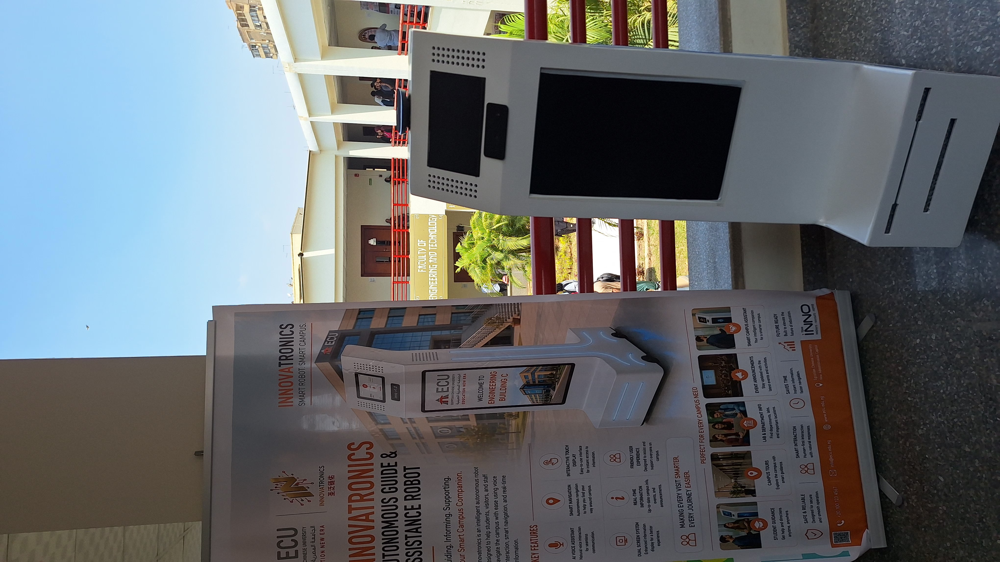
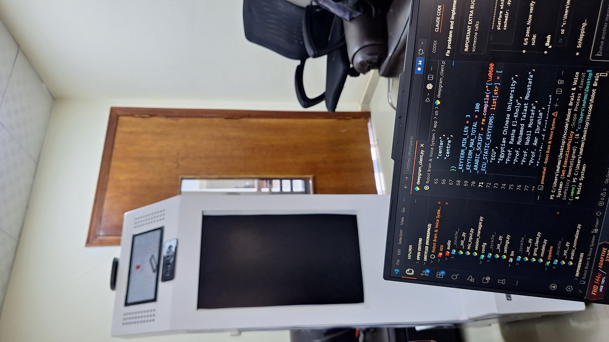
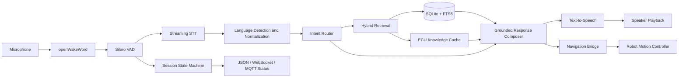

<div align="center">

# 🤖 INNO — Intelligent Campus Guide Robot

### A bilingual, voice-first campus assistant that connects grounded AI answers with real robot navigation

[](https://www.python.org/)
[](https://www.raspberrypi.com/)
[](#voice-and-conversation-pipeline)
[](#grounded-campus-intelligence)
[](#bilingual-experience)
[](#deployment)

**Ask where a room, lab, department, or staff member is. INNO listens, understands, retrieves verified campus data, responds by voice, and can hand a validated destination to the robot navigation layer.**

[Architecture](#system-architecture) · [Quick Start](#quick-start) · [Raspberry Pi Setup](./docs/raspberry_pi_setup.md) · [Testing](#testing) · [Developer](#developer-and-project-context)

</div>

---

## 🎯 Project Overview

**INNO** is a real-world campus guide robot developed for the Egyptian Chinese University (ECU). It is designed to help students, visitors, and staff find campus locations and information through natural voice interaction.

The repository contains the robot's **AI, voice, retrieval, conversation, and navigation-integration runtime**. The system combines wake-word detection, voice activity detection, streaming speech recognition, intent routing, grounded retrieval, text-to-speech, session management, and hardware-facing action commands in one continuously running pipeline.

Unlike a general chatbot, INNO is intentionally **domain-scoped and evidence-driven**. Campus answers are resolved from structured ECU data before the language model is allowed to enhance the response.

## 📸 Real-World Prototype

<p align="center">
  
</p>

<table>
  <tr>
    <td width="50%">
      
    </td>
    <td width="50%">
      
    </td>
  </tr>
  <tr>
    <td align="center"><strong>Campus demonstration</strong></td>
    <td align="center"><strong>AI and voice system development</strong></td>
  </tr>
</table>

## ✨ What INNO Can Do

- Wake locally when a user says **“Hey INNO.”**
- Detect speech boundaries using voice activity detection.
- Stream speech recognition for responsive conversations.
- Support English and an optional Arabic recognition path.
- Classify campus, navigation, academic, social, and off-topic requests.
- Retrieve buildings, rooms, labs, departments, staff, office hours, and landmarks from structured data.
- Ask clarification questions when a destination is ambiguous.
- Generate concise, grounded spoken answers.
- Send validated destination codes to the navigation action bridge.
- Publish live robot states to screen clients through JSON, WebSocket, or MQTT.
- Preserve multi-turn sessions, support interruptions, and recover from runtime failures.

## 🏗️ System Architecture



### 🔄 End-to-End Flow

```text
Wake word
   ↓
Voice activity detection
   ↓
Streaming speech-to-text
   ↓
Language detection and transcript normalization
   ↓
Intent classification
   ↓
Structured retrieval and ambiguity handling
   ↓
Grounded response generation
   ↓
Voice playback and optional navigation command
```

## ⚙️ Engineering Highlights

### 🎙️ Voice and Conversation Pipeline

The live runtime is orchestrated through **Pipecat** and custom processors that connect microphone audio, VAD, streaming STT, conversation control, navigation, TTS, playback, and runtime tracing.

Important runtime behavior includes:

- Wake acknowledgment with duplicate-trigger protection.
- Multi-turn conversation keepalive.
- Barge-in and interruption handling.
- Echo suppression around speaker playback.
- Session timeout and recovery behavior.
- Automatic runtime restart after unexpected failures.
- Stage-level latency tracing for routing, retrieval, TTS, and complete turns.

### 📚 Grounded Campus Intelligence

Campus data is maintained as editable English and Arabic CSV files, synchronized into **SQLite**, and indexed with **FTS5** for fast full-text lookup.

The retrieval path prioritizes:

1. Structured database matches.
2. Ambiguity detection and clarification.
3. ECU knowledge-cache lookup.
4. Controlled language-model fallback.

This architecture keeps factual campus answers tied to maintainable data rather than relying entirely on model memory.

### 🌐 Bilingual Experience

The voice layer supports two operating modes:

- **English-only mode:** Deepgram Nova-3 handles streaming speech recognition.
- **Bilingual mode:** Deepgram specializes in English while ElevenLabs Scribe handles Arabic, with arbitration and duplicate-final suppression between both recognition paths.

Arabic transcript normalization and dedicated Arabic retrieval logic improve handling of Egyptian Arabic campus requests, room references, and phonetic variations.

### 🧭 Navigation Safety Boundary

The AI layer never sends arbitrary free-form movement instructions directly to the robot.

Navigation requests must resolve to a known `nav_code`. The navigation bridge validates the target, handles busy/rejected/timeout states, and returns localized feedback when navigation cannot start safely.

### 🛡️ Operational Reliability

The project includes deployment-oriented safeguards:

- Pre-flight health checks for configuration, storage, audio devices, models, prompts, and dependencies.
- Typed environment configuration with Pydantic Settings.
- Structured application logging.
- Retry and fallback behavior for cloud services and TTS.
- Atomic runtime-status file updates.
- Optional WebSocket state broadcasting.
- Optional TLS-enabled MQTT publishing.
- Docker and Raspberry Pi 5 deployment support.
- Unit, integration, end-to-end, and hardware-marked tests.

## 🧰 Technology Stack

| Layer | Technology |
|---|---|
| **Language** | Python 3.11 |
| **Edge computer** | Raspberry Pi 5, 8 GB RAM |
| **Orchestration** | Pipecat |
| **Wake word** | openWakeWord with a local `hey_ino.onnx` model |
| **Voice activity detection** | Silero VAD |
| **English STT** | Deepgram Nova-3 |
| **Arabic STT** | ElevenLabs Scribe v2, optional |
| **Intent routing and response generation** | Groq-hosted Llama model |
| **Grounding layer** | SQLite, FTS5, CSV synchronization, ECU knowledge cache |
| **Text-to-speech** | edge-tts with English and Egyptian Arabic voices |
| **Robot integration** | Navigation action bridge and command bus |
| **UI state integration** | JSON, WebSocket, MQTT |
| **Configuration** | Pydantic Settings and `.env` |
| **Testing** | pytest and pytest-asyncio |
| **Deployment** | Raspberry Pi OS, Docker, optional systemd service |

## 📁 Repository Structure

```text
Intelligent-Campus-Guide-Robot/
├── app/
│   ├── actions/          # Navigation bridge and command bus
│   ├── audio/            # Microphone capture and session management
│   ├── config/           # Typed environment configuration
│   ├── llm/              # Groq client and model contracts
│   ├── pipeline/         # Pipecat runtime and conversation controller
│   ├── retrieval/        # English/Arabic retrieval and ECU knowledge
│   ├── routing/          # Intent classification
│   ├── storage/          # SQLite schema and CSV synchronization
│   ├── stt/              # Deepgram and optional Arabic STT
│   ├── tts/              # Speech synthesis and playback
│   ├── ui/               # Runtime status, WebSocket, and MQTT publishing
│   ├── vad/              # Silero voice activity detection
│   ├── wakeword/         # Local wake-word detection
│   └── main.py           # Runtime entry point
├── data/                 # Bilingual campus data and runtime storage
├── docker/               # Container image definition
├── docs/                 # Raspberry Pi deployment documentation
├── models/               # Local wake-word model
├── prompts/              # Router and response prompts
├── scripts/              # Health checks, smoke tests, and data refresh tools
├── tests/                # Unit, integration, end-to-end, and hardware tests
├── .env.example
├── Makefile
└── requirements.txt
```

## 🚀 Quick Start

### ✅ Requirements

- Python 3.11 or 3.12
- A microphone and speaker
- Internet access for the configured cloud speech and language services
- Deepgram and Groq API keys
- ElevenLabs key only when bilingual Arabic STT is enabled

### 📦 Installation

```bash
git clone https://github.com/MahmoudNagiubX/Intelligent-Campus-Guide-Robot.git
cd Intelligent-Campus-Guide-Robot

python -m venv .venv
```

Activate the environment:

```powershell
# Windows PowerShell
.\.venv\Scripts\Activate.ps1
```

```bash
# Linux / Raspberry Pi
source .venv/bin/activate
```

Install dependencies and create the environment file:

```bash
python -m pip install --upgrade pip
pip install -r requirements.txt
cp .env.example .env
```

On Windows PowerShell, use:

```powershell
Copy-Item .env.example .env
```

Add the required keys:

```env
DEEPGRAM_API_KEY=your_deepgram_key_here
GROQ_API_KEY=your_groq_key_here
ENGLISH_ONLY_MODE=true
```

Validate the environment, then start INNO:

```bash
python -m scripts.health_check
python -m app.main
```

Try:

```text
Hey INNO, where is the robotics lab?
```

## 🔧 Configuration Modes

### 🗣️ Enable Arabic

```env
ENGLISH_ONLY_MODE=false
ELEVENLABS_API_KEY=your_elevenlabs_key_here
```

### 📡 Enable MQTT Robot-State Publishing

```env
MQTT_ENABLED=true
MQTT_BROKER=your_broker_host
MQTT_USERNAME=your_username
MQTT_PASSWORD=your_password
```

The AI runtime publishes simplified state values for hardware/UI coordination:

```text
wait   → idle
listen → listening or processing
speak  → voice playback
```

## 🧪 Testing

The suite separates deterministic software tests from tests that require real hardware or live credentials.

```bash
# Full suite
pytest -q

# Unit tests
pytest tests/unit -q

# Integration tests
pytest tests/integration -q

# Mock smoke test
python -m scripts.smoke_test

# Pre-flight deployment check
python -m scripts.health_check
```

Hardware-dependent scenarios are marked separately in `pytest.ini`.

## 🖥️ Deployment

The primary target is a **Raspberry Pi 5 running Raspberry Pi OS 64-bit**.

Deployment support includes:

- CPU-only PyTorch installation guidance.
- USB microphone and speaker configuration.
- Docker support for ARM64 and x86 development environments.
- Startup health checks.
- Optional systemd auto-start service.
- Runtime logs and automatic restart behavior.

See the complete guide: [`docs/raspberry_pi_setup.md`](./docs/raspberry_pi_setup.md)

## ⚠️ Design Boundaries

- INNO is a campus-focused assistant, not a general-purpose chatbot.
- Cloud STT, routing, and TTS services require a stable network connection.
- Physical navigation is executed by an external robot-control layer through validated target codes.
- Audio-device indexes and echo behavior must be tuned for the deployed microphone and speaker setup.
- Campus accuracy depends on keeping the CSV knowledge sources current.

## 🏆 Recognition

The broader **INNOVATRONICS** robot platform received **1st Place Overall at the Made in ECU Competition**. The project brought together AI, software, embedded systems, navigation, electronics, mechanical design, UI/UX, and communication into one working campus-assistance platform.

## 👨‍💻 Developer and Project Context

This is a team robotics project developed as part of **INNOVATRONICS at the Egyptian Chinese University**.

### 🎯 My Focus — Mahmoud Nagiub

My primary contribution was the **AI and voice system** represented in this repository, including the streaming conversation pipeline, grounded campus retrieval, bilingual handling, response orchestration, runtime reliability, robot-state integration, and Raspberry Pi deployment work.

This project reflects the kind of engineering I want to continue building: AI systems that do more than return text—systems that interact with real users, connect to physical hardware, manage failure states, and operate as part of a complete product.

- GitHub: [@MahmoudNagiubX](https://github.com/MahmoudNagiubX)
- LinkedIn: [Mahmoud Nagiub](https://www.linkedin.com/in/mahmoudnagiubb/)

---

<div align="center">

**Built by a multidisciplinary team. Grounded in real campus data. Designed for real human interaction.** 🤖

</div>
